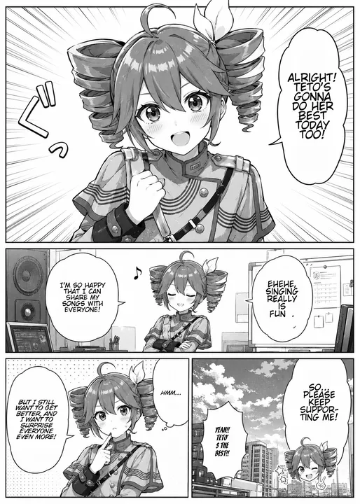

# tetolate

[Changelog](CHANGELOG.md)

tetolate is a self-hosted program to run a total end-to-end translation of mangas / comic archives. Which means, put manga in (japanese/korean/chinese), get manga out english.

It runs entirely on your computer. It is up to you (end user) to run the vision-language model (VLM) for tetolate to use.

Recommended models:
- Gemma 4 12B -- Good, on par with 26B-A4B
- Gemma 4 26B-A4B -- Good, on par with 12B
- Gemma 4 31B -- Best

NOT recommended models:
- Qwen 3.x -- Translation is too stiff and less accurate.

Please note that tetolate is designed for max quality over speed. This is NOT a real time translation software. With 40 tps on Gemma 4 31B, I see ~1 min/page for low text mangas an ~2m30/page for high text mangas.

## Example

original image genn'd by chatgpt because i don't exactly have redist permission on mangas. let me know if there's a better example!

Model: Gemma 4 31B 4bpw via ExLlamaV3, Font: Wild Words

| Original | Translated |
| --- | --- |
|  |  |

## Features

Accepts `cbz`, `zip` full of images, or a direct collection of images.

View translated pages in the browser. Generate an optional PNG, WebP, or JXL CBZ download when needed.

Web UI + password to upload, view jobs, and download.

Editor to fix minor errors, primarily OCR misses.

## Requirements

- Docker or Podman
- An OpenAI-compatible vision-language model endpoint -- If running the VLM locally (which is expected), at least 8 GB of free VRAM to run Gemma 4 12B, or for the truly desperate, offload that to RAM. By default tetolate assumes this is on `127.0.0.1:8080/v1`; change `vlm_config.json` if different.
- If using PaddleOCR-VL 1.6 (recommended) 10+ gb of free RAM
- Optional professional comic fonts. Tetolate includes open stand-in fonts when no user fonts are installed.

Tested on x86-64 Linux with Docker and Podman. ARM, Windows, and macOS are not currently tested.

## Install

Docker/Podman is the recommended installation path. For source builds and native development, see [BUILDING.md](BUILDING.md).

Internet is required for a first run to download the necessary models off Huggingface and Paddle.

Start an OpenAI-compatible vision-language model endpoint.

NOTE: For Gemma 4, the default tokens dedicated per image is relatively low which can cause poor performance. To max tokens per image, if running via llama.cpp add `--image-min-tokens 1120`, or with ExLlamaV3 go to your model's `processor_config.json` and set

```json
"image_processor": {
    ...
    "max_soft_tokens": 1120,
    ...
}
```

Grab the compose yaml and run the image.

```bash
curl -fsSLO https://raw.githubusercontent.com/potatoes1286/tetolate/refs/heads/main/compose.yaml
docker compose up -d
docker compose logs tetolate
```

(If using podman, simply swap out docker for podman here.)

Default password is `changeme`. Navigate to `http://127.0.0.1:8088` and log in. After logging in, change it.


### Configuration

#### OCR Service

There are two options for OCR. The built in PaddleOCR is quick, cheap, and not the best. For maximum quality, use PaddleOCR-VL 1.6. PaddleOCR-VL is the recommended path.

To use PaddleOCR-VL, download the two GGUF files and chat template listed in the [model guide](https://github.com/potatoes1286/tetolate/blob/main/data/models/README.md) into `data/models`, and run

```bash
docker compose down
docker compose --profile paddleocr-vl up -d
```

and select PaddleOCR-VL in the job's advanced options.

#### Expose to Network

By default, the docker container will only listen to local requests (same computer). To access the web UI from another computer within the same network, change `127.0.0.1` to `0.0.0.0` in `compose.yaml`. It is highly NOT advised to expose it further to WAN requests.

#### Fonts

tetolate bundles some open fonts for quick setup. The default setup is

```
ComicNeue-Bold.ttf: talking, narrator, general text, fallback
ComicNeue-BoldItalic.ttf: thinking, monologue, quiet internal speech
IBMPlexMono-Medium.ttf: computer text, terminal text, electronic text
ArchitectsDaughter-Regular.ttf: handwritten text, notes, letters
Bangers-Regular.ttf: sfx, loud shout, explosive or emphatic text
```

If you have your own, better, private fonts, put your files in `data/fonts` and create `font_use.txt` as described in [the font configuration guide](https://github.com/potatoes1286/tetolate/blob/main/data/fonts/README.md). The most common "Manga font" you see (and is used in the example above) is Wild Words, which is not freely available.

#### Prompts

VLM prompts are plain text files in `data/prompts/`. They are read for each request, so edits apply to the next pass without restarting. See `data/prompts/README.md` for placeholder and custom-directory details.

#### Updating

Download the Compose file for the new version, pull its image, and recreate the container.

```bash
curl -fsSL https://raw.githubusercontent.com/potatoes1286/tetolate/refs/heads/main/compose.yaml -o compose.yaml
docker compose pull
docker compose up -d
```

## Pipeline

1. ocr_raw -- detect text with PaddleOCR or PaddleOCR-VL
2. ocr_merged -- merge nearby OCR detections with deterministic geometry
3. ocr_structured -- reject false positives, classify text, and set reading order with the VLM
4. alt_placement -- optionally classify text that must not be erased in place
5. translations -- translate each page with the VLM
6. proofreading -- optionally proofread translations in bounded batches
7. translation_notes -- optionally create reusable notes for related translations
8. placements -- determine text regions and styles
9. render -- clean text with LaMa and draw translated text with ImageMagick
10. package -- generate PNG, WebP, and JXL CBZ downloads

## Extra

Third-party software and models keep their own licenses; see [THIRD_PARTY_NOTICES.md](THIRD_PARTY_NOTICES.md).

For legal reasons, be aware that copyright exists

I vibed this with mr. codex for my own personal use. Uploaded to share. Do not expose it to WAN, etc.
